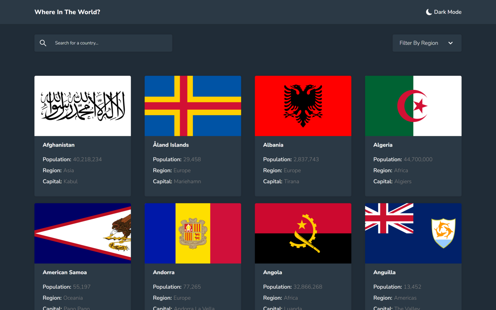
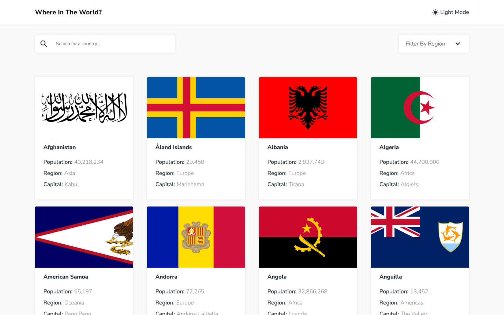
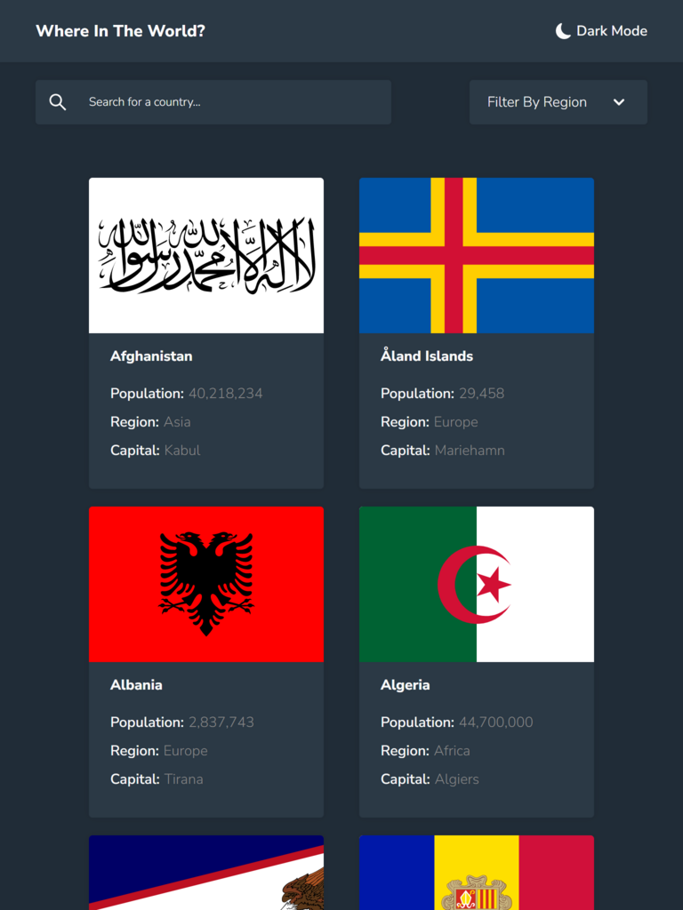
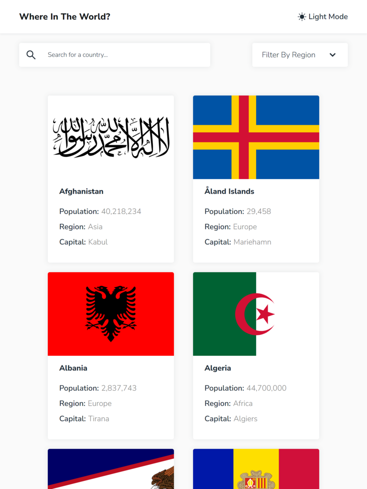
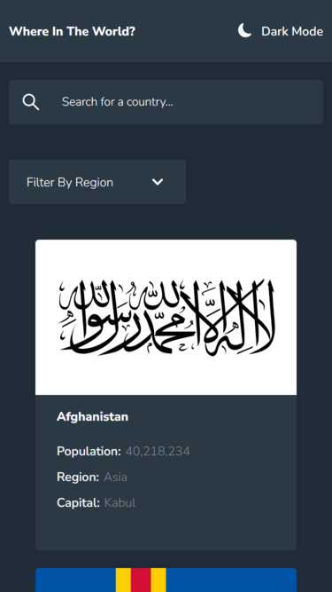
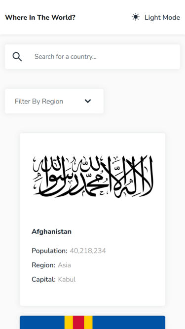

# Frontend Mentor - REST Countries API with color theme switcher solution

This is a solution to the [REST Countries API with color theme switcher challenge on Frontend Mentor](https://www.frontendmentor.io/challenges/rest-countries-api-with-color-theme-switcher-5cacc469fec04111f7b848ca).

## Table of contents

- [Overview](#overview)
  - [The challenge](#the-challenge)
  - [Screenshot](#screenshot)
  - [Links](#links)
- [My process](#my-process)
  - [Built with](#built-with)
- [Author](#author)

## Overview

### The challenge

Users should be able to:

:white_check_mark: See all countries from the API on the homepage

:white_check_mark: Search for a country using an `input` field

:white_check_mark: Filter countries by region

:white_check_mark: Click on a country to see more detailed information on a separate page

:white_check_mark: Click through to the border countries on the detail page

:white_check_mark: Toggle the color scheme between light and dark mode

### Screenshot

#### Desktop

#### tablet

#### Mobile

### Links

- Solution URL: [HERE](https://www.frontendmentor.io/solutions/restcountriesapi-using-react-axios-scss-responsive-design-EEf0ThD-6b)
- Live Site URL: [HERE](https://react-rest-api-countries-95.netlify.app/)

## My process

### Built with

- HTML5
- SCSS
- Flexbox
- Grid
- Responsive layout
- [React](https://reactjs.org/) - JS library
- [React Hooks](https://reactjs.org/docs/hooks-intro.html)
- [React Router Dom](https://reactrouter.com/)
- [Axios](https://axios-http.com/docs/intro)

## Author

- Frontend Mentor - [@MBenmasour95](https://www.frontendmentor.io/profile/MBenmasour95)
